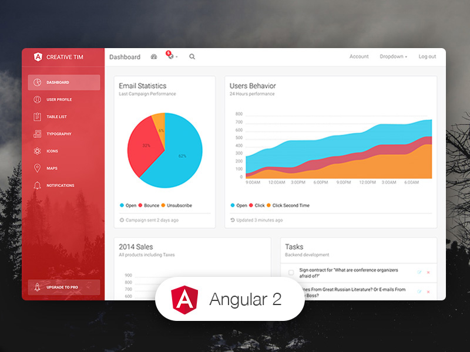

# Bank Ranking
[![version][version-badge]][CHANGELOG] ![license][license-badge]



Bank Ranking using lbd-chart
Financial information needed for the analysis
of financial indicators
final changes in graphical report
Average Bank Ranking,
deleted user,
final charts api,
Create Profile,
financial profile report,
login,
notifications,
average,
deleted user,
login interface,
graphical report

using Angular, bootstrap,lbd-chart
## Terminal Commands

1. Install NodeJs from [NodeJs Official Page](https://nodejs.org/en).
2. Open Terminal
3. Go to your file project
4. Run in terminal: ```npm install -g @angular/cli```
5. Then: ```npm install```
6. And: ```ng serve```
7. Navigate to `http://localhost:4200/`

### What's included

Within the download you'll find the following directories and files:
```
light-bootstrap-dashboard-angular
├── CHANGELOG.md
├── LICENSE.md
├── README.md
├── angular.json
├── documentation
│   ├── css
│   └── tutorial-lbd-angular2.html
├── e2e
├── karma.conf.js
├── package-lock.json
├── package.json
├── protractor.conf.js
├── src
│   ├── app
│   │   ├── app.component.css
│   │   ├── app.component.html
│   │   ├── app.component.spec.ts
│   │   ├── app.component.ts
│   │   ├── app.module.ts
│   │   ├── app.routing.ts
│   │   ├── home
│   │   │   ├── home.component.css
│   │   │   ├── home.component.html
│   │   │   ├── home.component.spec.ts
│   │   │   └── home.component.ts
│   │   ├── icons
│   │   │   ├── icons.component.css
│   │   │   ├── icons.component.html
│   │   │   ├── icons.component.spec.ts
│   │   │   └── icons.component.ts
│   │   ├── layouts
│   │   │   └── admin-layout
│   │   │       ├── admin-layout.component.html
│   │   │       ├── admin-layout.component.scss
│   │   │       ├── admin-layout.component.spec.ts
│   │   │       ├── admin-layout.component.ts
│   │   │       ├── admin-layout.module.ts
│   │   │       └── admin-layout.routing.ts
│   │   ├── lbd
│   │   │   ├── lbd-chart
│   │   │   │   ├── lbd-chart.component.html
│   │   │   │   └── lbd-chart.component.ts
│   │   │   └── lbd.module.ts
│   │   ├── maps
│   │   │   ├── maps.component.css
│   │   │   ├── maps.component.html
│   │   │   ├── maps.component.spec.ts
│   │   │   └── maps.component.ts
│   │   ├── notifications
│   │   │   ├── notifications.component.css
│   │   │   ├── notifications.component.html
│   │   │   ├── notifications.component.spec.ts
│   │   │   └── notifications.component.ts
│   │   ├── shared
│   │   │   ├── footer
│   │   │   │   ├── footer.component.html
│   │   │   │   ├── footer.component.ts
│   │   │   │   └── footer.module.ts
│   │   │   └── navbar
│   │   │       ├── navbar.component.html
│   │   │       ├── navbar.component.ts
│   │   │       └── navbar.module.ts
│   │   ├── sidebar
│   │   │   ├── sidebar.component.html
│   │   │   ├── sidebar.component.ts
│   │   │   └── sidebar.module.ts
│   │   ├── tables
│   │   │   ├── tables.component.css
│   │   │   ├── tables.component.html
│   │   │   ├── tables.component.spec.ts
│   │   │   └── tables.component.ts
│   │   ├── typography
│   │   │   ├── typography.component.css
│   │   │   ├── typography.component.html
│   │   │   ├── typography.component.spec.ts
│   │   │   └── typography.component.ts
│   │   ├── upgrade
│   │   │   ├── upgrade.component.css
│   │   │   ├── upgrade.component.html
│   │   │   ├── upgrade.component.spec.ts
│   │   │   └── upgrade.component.ts
│   │   └── user
│   │       ├── user.component.css
│   │       ├── user.component.html
│   │       ├── user.component.spec.ts
│   │       └── user.component.ts
│   ├── assets
│   │   ├── css
│   │   ├── fonts
│   │   ├── img
│   │   └── sass
│   │       ├── lbd
│   │       └── light-bootstrap-dashboard.scss
│   ├── environments
│   ├── favicon.ico
│   ├── index.html
│   ├── main.ts
│   ├── polyfills.ts
│   ├── styles.css
│   ├── test.ts
│   └── tsconfig.json
├── tslint.json
└── typings.json

```
Instagram: <https://instagram.com/creativetimofficial>

[CHANGELOG]: ./CHANGELOG.md

[version-badge]: https://img.shields.io/badge/version-1.7.0-blue.svg
[license-badge]: https://img.shields.io/badge/license-MIT-blue.svg
